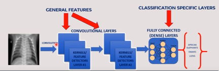
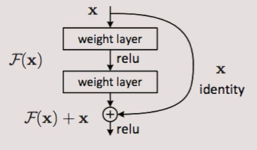
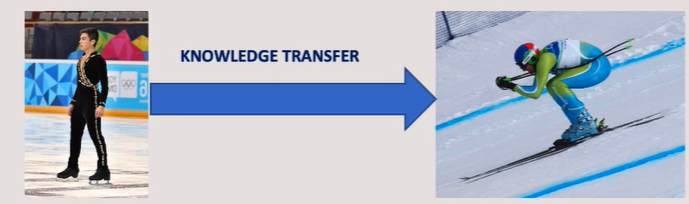
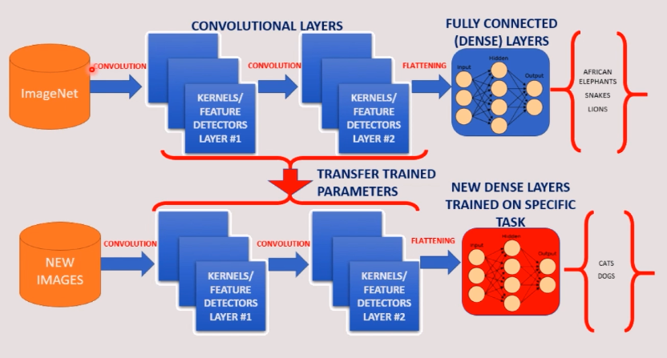

# Departamento de vendas - Séries temporais

## Objetivo

Detectar e classificcar doenças pulmonares, reduzindo o custo e tempo de detecção

## Estudo de caso

Vamos trabalhar com redes neurais convolucionais, que é o tipo de rede neural mais eficiente para trabalhar com classificação de imagens
Os profissionais da saúde coletaram várias imagens de raio-x, 133 imagens que percentem a 4 classes: 
- Healthy (saudável)
- Covid-19
- Bacterial Pneumonia
- Viral Pneumonia

## Redes Neurais Convolucionais

Vamos enviar a imagem a uma série de camadas

1. Camadas convolucionais: extrair características mais básicas da imagem. Podemos ter vários detectores de características (32, 64, 128...) **processamento da imagem**
   1. Na imagem há 2 camadas de convolução, mas na vida real pode ter centenas
   2. converte a imagem em um vetor.
2. Fully Connected **rede neural tradicional**: envia os dados da imagem na camada de entrada, com uma output. 

### Função Relu

Se n >= 0, então n = n

Se n < 0, então n = 0

## Redes Neurais Convolucionais

- **LeNet-5 (1998):** 7 níveis de convolução aplicada na classificação de dígitos manuscritos
- **AlexNet (2021):** Apresentou melhorias, reduzindo o erro de 26% para 15,3%
- **ZFNet (2013):** erro de 14,8%
- **Googlenet/Inceptiton (2014):** erro de 6,67% *(similar a precisão humana)*
- **VGGNet (2014)**
- **ResNet (2015):** Residual Neural Network com a inclusão do conceito de "skip connection" que permitiu o treinamento de 152. Erro de 3,57% *(superior aos humanos)*

### ResNet - Residual Neural Network

- Problema do gradiente desaparecendo *(vanish gradient problem)*  
- **Skip connection** resolve esse problema (arquitetura YOLO - *p/ reconhecimento de objetos*)
  - Quando trabalhamos com muitas camadas,, os pesos da RN deve ser propagada pelas camadas, com isso, os gradientes começam a desaparecer
  - Ele repassa a informação original para a próxima camada
- A base de dados ImageNet contém 11 milhões de imagens e 11.000 categorias
- Essa base de dados é utitlizada para treinar a arquitetura ResNet

## Transferência de Aprendizagem

Podemos reaproveitar o conhecimento da Rede Neural ResNet para resolver problemas específicos

- É uma técnica na qual uma rede neural foi treinada para realizar uma determinada tarefa e é recusada como ponto d partida para uma tarefa similar
- Muito útil porque reduz drasticamente o tempo de treinamento

