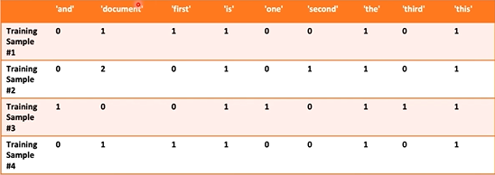

# Departamento deRelações Públicas - Processamento de linguagem natural

## Objetivo

Usar uma base de dados para analisar os reviews das pessoas e criar um classificador de sentimentos para definir se um comentário é positivo ou negativo. Assim, analisando os textos podemos saber se o produto está sendo bem ou mal avaliado pelos clientes.

## Estudo de caso

Nós somos uma empresa que possui determinado(s) produto(s) e os clientes podem fazer uma review desse(s) produto(s) através de um texto e nota.  

Os clientes podem fazer uma review dos produtos da empresa através de um texto e nota.  

- O DPTO de relações públicas coletou textos escritos pelos seus clientes.
- O processamento de linguagem natural pode ser utilizado para prever se clientes estão ou não satisfeitos. Essa é uma área responsável pela análise da linguagem humana, tanto texto quanto voz.
- Conversão de letras para números para treinar os modelos de aprendizagem de máquina.
- Não há necessidade de analisar os textos manualmente

### Tokenização (Count Vectorizer)

Transformar letra em números para passar aos algoritmos de aprendizagem de máquina

> This is the first document.  
>
> This document is the second document.  
>
> And this is the third one.  
>
> Is this the first document?  

