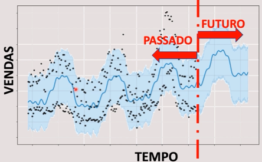

# Departamento de vendas - Séries temporais

## Objetivo

Fazer a previsão de vendas no futuro utilizando dados do passado. 

## Estudo de caso

- Quando utilizamos essa ferramenta do Facebook, nós temos a integração dos feriados
- Modelos de previsão de vendas futuras baseados em dados do passado devem considerar efeitos sazonais, como por exemplo: demanda, feriados, promoções e concorrência

| Dados das transações | Descrição                                                    |
| -------------------- | ------------------------------------------------------------ |
| ID                   | Identificador da transação (loja +data)                      |
| Loja                 | Identificador único da loja                                  |
| Sales                | Vendas/dia (objetivo)                                        |
| Customers            | Número de clientes no dia                                    |
| Open                 | Boleano que indica se a loja estava aberta ou fechada        |
| Promo                | Se existe uma promoção no dia                                |
| StateHoliday         | Feriado (a = feriado público; b = páscoa; c = natal; 0 = Nenhum) |
| SchoolHoliday        | Feriado escolar                                              |

| Dados das lojas                | Descrição                                                    |
| ------------------------------ | ------------------------------------------------------------ |
| StoreType                      | Tipo da loja (a, b, c, d)                                    |
| Assorment                      | Tipo de loja (a=basic; b=extra; c=extended)                  |
| ComptetitionDistance (metros)  | Distância para loja concorrente mais perto                   |
| CompetitionOpenSince (mes/ano) | Data que a concorrente foi aberta                            |
| Promo2                         | Promoção contínua e consecutiva em algumas lojas; promoção adicional; sua participação na loja é opcional (0 = não está participando; 1 = está participando) |
| Promo2Since (ano/semana)       | Data quando a loja começou a participar da Promo2            |
| PromoInterval (meses)          | Intervalos consecutivos que a Promo2 é iniciada. Exemplo. "Feb,May,Aug,Nov" indica que cada "round" da promoção começa nesses meses |

