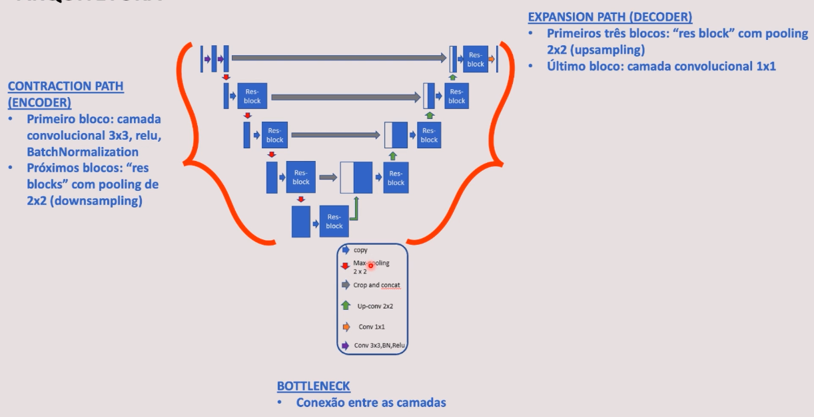

# Departamento de produção e manutenção

## Objetivo

Fazer a detecção de peças defeituosas e segmentar os problemas nas peças.

## Estudo de caso

- IA e ML estão transformando a indústria, principalmente os departamentos de produção e manutenção.

## Mask (máscara)

- O objetivo da segmentação de imagens é "entender" a imagem em si pixel a pixel, sendo que cada pixel é associado a uma classe. Assim, classificando cada pixel da imagem.

- A saída da segmentação produz uma nova imagem, que é chamada de "máscara da imagem". 

- Máscaras podem ser representadas associando valores de pixels para coordenadas.

- Para representar máscaras aplicamos o processo de "flattening" 1-D array

  

## Run Length Encoding (RLE)

- Técnica para compressão de dados que armazena sequências que contém dados consecutivos (combinação em um só valor). Ou seja, reduzir a dimensionalidade
- Consideramos que temos uma imagem com texto preto em fundo branco

WWWWWWWWWWWWBWWWWWWWWWWWWBBBWWWWWWWWWWWWWWWWWWWWWWWWBWWWWWWWWWWWWWW

- RLE

12W1B12W3B24W1B14W

## Arquitetura RESUNET

arquitetura de rede neural convolucional para trabalhar com segmentação de imagens (classificação pixel a pixel para separarmos numa imagem onde está o defeito da peça)  

A RESUNET combina a arquitetura UNet com blocos residuais (skip connection) para reduzir o problema do gradiente desaparecendo (vanish gradient problem)  

> Quando se tem uma série de camadas e os pesos estão fluindo de uma camada a outra, a teandencia é de quanto mais camadas você tenha esse valor vai diminuindo e ficando insignificante

Consiste em 3 partes:

1. Encoder or contracting path

2. Bottleneck (imagem na menor dimensionalidade)

3. Decoder or expansive path

- No skip connection *(seta cinza)*, além de passarmos a informação para as camadas subsequentes, nós passamos também para as camadas da frente. Recebe informações de processamentos anteriores.  
- BatchNormalization é uma forma de realizar a normalização nas camadas ocultas da rede neural.

> **Copy**: Após aplicar o Max Pooling, se faz uma cópia para o Resblock  
>
> **Max pooling**: reduz a dimensionalidade  
>
> **Crop and concat**: concatenação (skip connection)  
>
> **Up-conv 2x2**: aumenta a dimensionalidade  
>
> **Conv 1x1**: Aplicação da camada convolucional para o output  
>
> **Conv 3x3, BN, Relu**: Aplicação da função relu e BatchNormalization 
>
> 
