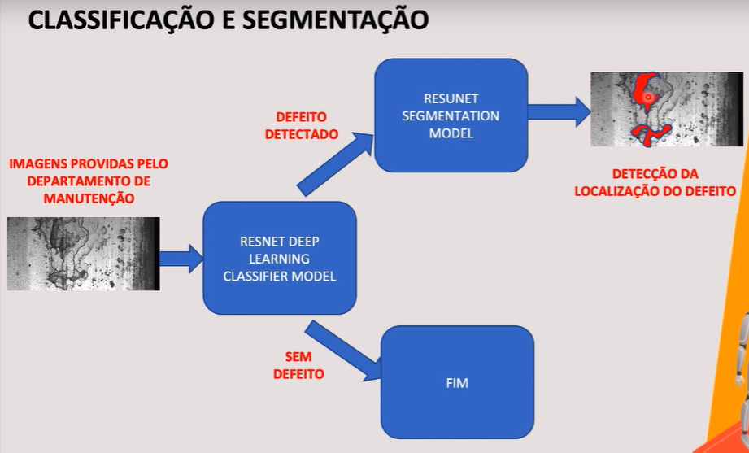
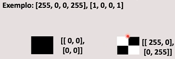

# Departamento de produção e manutenção

## Objetivo

Fazer a detecção de peças defeituosas e segmentar os problemas nas peças.

## Estudo de caso

- IA e ML estão transformando a indústria, principalmente os departamentos de produção e manutenção.

## Mask (máscara)

- O objetivo da segmentação de imagens é "entender" a imagem em si pixel a pixel, sendo que cada pixel é associado a uma classe. Assim, classificando cada pixel da imagem.

- A saída da segmentação produz uma nova imagem, que é chamada de "máscara da imagem". 

- Máscaras podem ser representadas associando valores de pixels para coordenadas.

- Para representar máscaras aplicamos o processo de "flattening" 1-D array

  

## Run Length Encoding (RLE)

- Técnica para compressão de dados que armazena sequências que contém dados consecutivos (combinação em um só valor). Ou seja, reduzir a dimensionalidade
- Consideramos que temos uma imagem com texto preto em fundo branco

WWWWWWWWWWWWBWWWWWWWWWWWWBBBWWWWWWWWWWWWWWWWWWWWWWWWBWWWWWWWWWWWWWW

- RLE

12W1B12W3B24W1B14W
