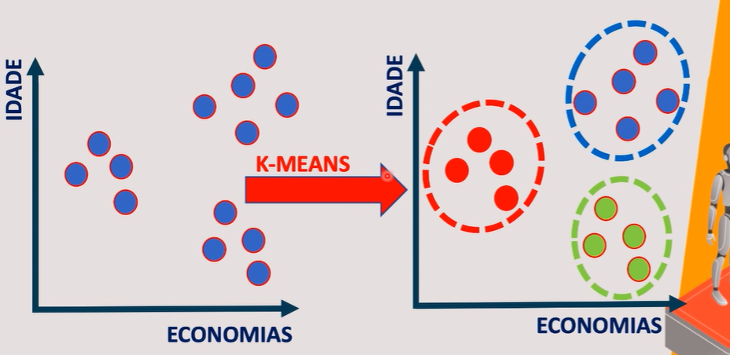
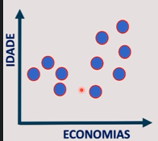
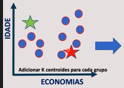
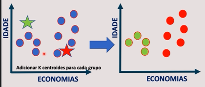
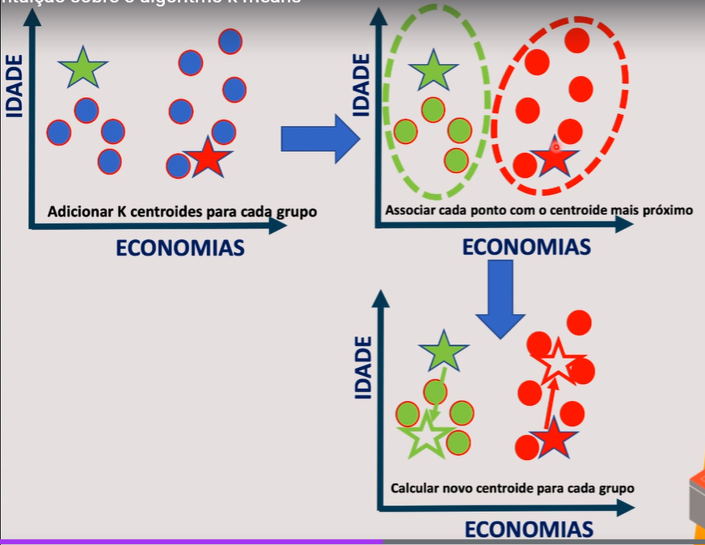
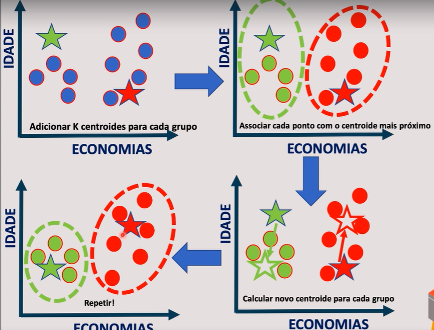
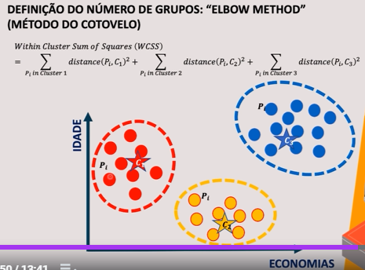
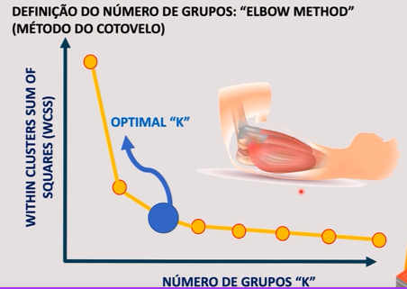
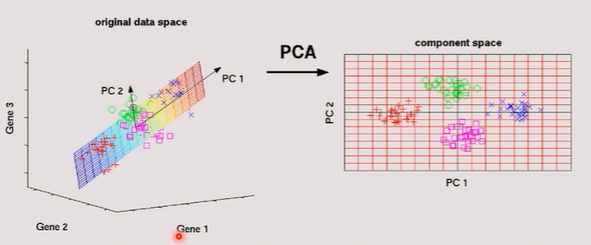
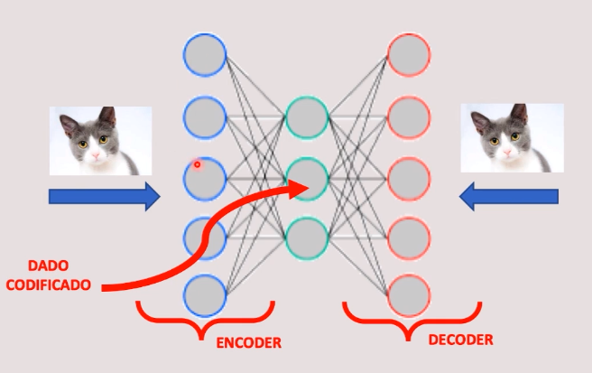

# Departamento de Marketing

## Contexto geral

A empresa precisa realizar campanhas personalizadas para cada tipo de perfil de cliente.

O objetivo maior é entender os hábitos do cliente, para que assim possamos agrupá-los por área de interesse. 

- entender os clientes e identificar suas necessidades
- entendendo os consumidores, podemos enviar campanhas específicas para necessidades específicas

| Coluna                           | Descrição                                                    |
| -------------------------------- | ------------------------------------------------------------ |
| CUSTID                           | Identificação do cliente                                     |
| BALANCE                          | Saldo para fazer compras                                     |
| BALANCE_FREQUENCY                | Frequência que o saldo é atualizado (1 = frequente, 0 = não frequente) |
| PURCHASES                        | Valor de compras realizadas                                  |
| ONEOFFPURCHASES                  | Valor de compras realizadas                                  |
| INSTALLMENTS_PURCHASES           | Valor de compras parceladas                                  |
| CASH_ADVANCE                     | Dinheiro adiantado                                           |
| PURCHASES_FREQUENCY              | Frequência das compras (entre 1 e 0)                         |
| ONEOFF_PURCHASES_FREQUENCY       | Frequência de compras à vista (entre 1 e 0)                  |
| PURCHASES_INSTALLMENTS_FREQUENCY | Frequência de compras parceladas (entre 1 e 0)               |
| CASH_ADVANCE_FREQUENCY           | Frequência de saques de dinheiro adiantado                   |
| CASH_ADVANCE_TRX                 | Número de transações feitas como "Cash in Advance" (foi no caixa eletrônico e solicitou dinheiro adiantado) |
| PURCHASES_TRX                    | Número de compras                                            |
| CREDIT_LIMIT                     | Limite do cartão de crédito                                  |
| PAYMENTS                         | Valor pago                                                   |
| MINIMUM_PAYMENTS                 | Valor mínimo pago                                            |
| PRC_FULL_PAYMENT                 | Percentual de pagamentos da fatura completa                  |
| TENURE                           | Posse do titular do cartão                                   |

## K-means

Algoritmo para trabalhar com agrupamento de dados.

- Algoritmo não supervisionado (clustering - agrupamento)
  - Não temos uma classe, o objetivo não é previsões
- Os registros são agrupados baseado em atributos similares, por meio do cálculo da Distância Euclidiana
  - Formula matemática que vai medir o quanto dois pontos são parecidos

### Exemplo

> **Queremos encontrar dois grupos**
>
> 

> **Criaremos K centróides, sendo k=2. Os centróides são pontos que são inicializados aleatoriamente na base de dados**
>
> *Os centróides possuem o valor médio do grupo que ele pertence, ou seja, ele possui a idade média do grupo e o valor economico médio do grupo*
>
> 

> **Após a criação dos centróides, verificamos os pontos que estão mais próximos de algum centróide existente**
>
> 

> **Vamos calcular um novo centróide para cada grupo**
>
> 

> **Vamos repetir da atualização dos centróides, o que pode acontecer é um dado mudar de grupo nessas atualizações da posição dos centróides**
>
> 

## Qual a quantidade adequada de grupos?

Quando o valor do WCSS não possui uma queda tão brusca, não é interessante aumentar o número de grupos. Por isso esse método é chamado de método do cotovelo

## PCA - Principal Component Analysis

É utilizado para redução da redimensionalidade. Ajuda na visualização do agrupamento

- É um algoritmo de aprendizagem não supervisionada
  - Não há uma classe que eu queira fazer previsão
- Aplica a redução de dimensionalidade, porém, tentar manter as informações originais com as mesmas características
- Encontra um novo conjunto de características que são chamados de componentes
- Os componentes são criados por meio das características não correlacionadas
  - Torna possível a redução dos principais componentes

## Autoencoders

- São um tipo de redes neurais artificiais para codificar dados

- Utiliza a mesma entrada e a mesma saída para comparar os resultados

Ex: queremos reduzir o tamanho de uma imagem. Após a codificação e posterior decodificação, temos que comparar ambas as imagens

![(img2.png)

1. Versão comprimida da informação na camada do meio (codificação)
2. Funciona se existir correlação entre dados de input
   1. Os resultados serão ruins se os dados forem independenetes

