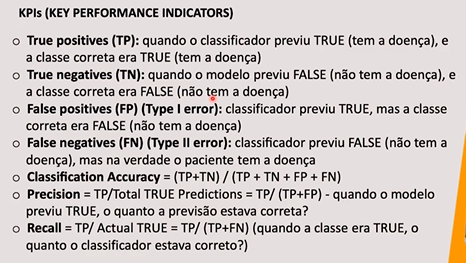
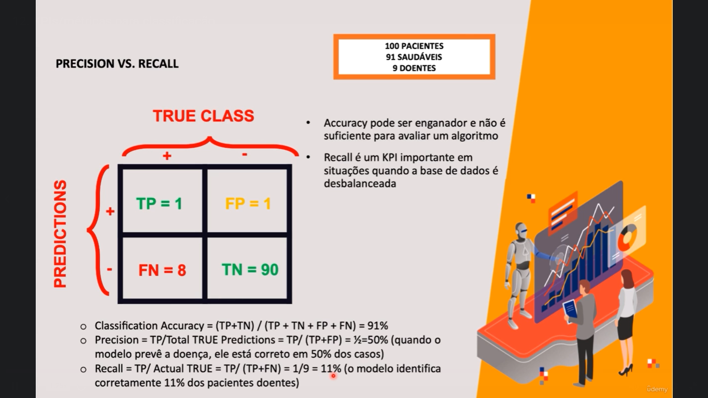
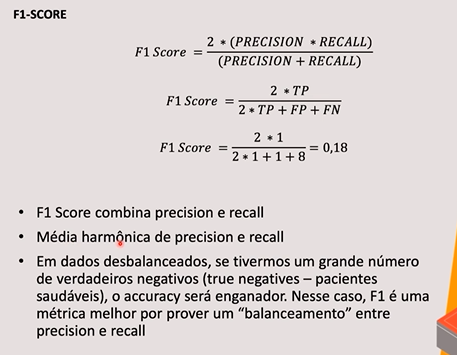

# Departamento de recursos humanos

O departamento de RH coletou dados dos funcionários e gostaria que você fizesse a previsão de quais são mais propensos para sair do emprego  
Alguns exemplos de dados:  

- Envolvimento com o trabalho
- Escolaridade
- Satisfação com o trabalho
- Métricas de desempenho
- Relacionamento
- Equilíbibro entre atividades pessoais e profissionais

## Métodos de aprendizagem de máquina

### Regressão Linear

é usada para prever números

ex: previsão de lucros baseado na temperatura

### Regressão Logística

é usada para prever saídas binárias

ex: aprovado/reprovado, ganhar/perder, saudável/doente

É necessário criar a linha em formato de *S* para classificar os registros

### Random Forest

É considerado com conjunto e algoritmos (ensemble)

Cria um conjunto de árvores de decisão baseados em atributos randômicos

Combina os votos de diferentes árvores de decisão

ex: classificar se uma pessoa pode se aposentar baseado nas economias e idade

### Redes neurais artificiais 

objetivo: encontrar o melhor conjunto de pesos

## KPIs/Métricas para classificação

**Como fazer a avaliação de algoritmos de classificação** 

**TRUE CLASS:** respostas verdades na base de dados. Por exemplo, o **positivo (+)** pode ser a pessoa que vai sair do emprego e o **negativo (-)** a pessoa que **não** vai sair do emprego

**PREDICTIONS: **previsões que o algoritmo faz. O objetivo é criar um modelo e o modelo fazer uma revisão

| **TRUE+ **| Predição indica que funcionário vai sair da empresa e na base de dados o funcionário saiu da empresa

| **TRUE-** | Predição indica que funcionário não vaia sair da empresa e na base de dados o funcionário não saiu da empresa

| **FALSE+** | Predição indica que funcionário vai sair da empresa e na base de dados o funcionário não saiu da empresa

| **FALSE-** | Predição indica que funcionário não vai sair da empresa e na base de dados o funcionário saiu da empresa

**Acurácia** não é recomendado para visualização, pois ele pode mascarar os resultados negativos de aprendizagem de máquina. Com isso, o **Precision** e o **Recall** possuem essa qualidade de visualizar a previsão positivas na base de dados

**O algoritmo classifica muito bem os pacientes que não estão doentes e classifica muito mal os pacientes que estão doentes**

**F1-SCORE** é recomendado quando a base de dados está desbalanceada, ou seja, possuem mais valores positivos do que negativos, e vice-versa
